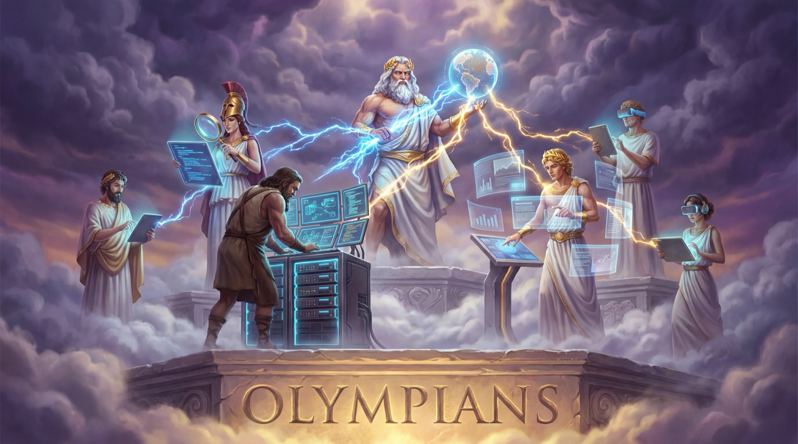
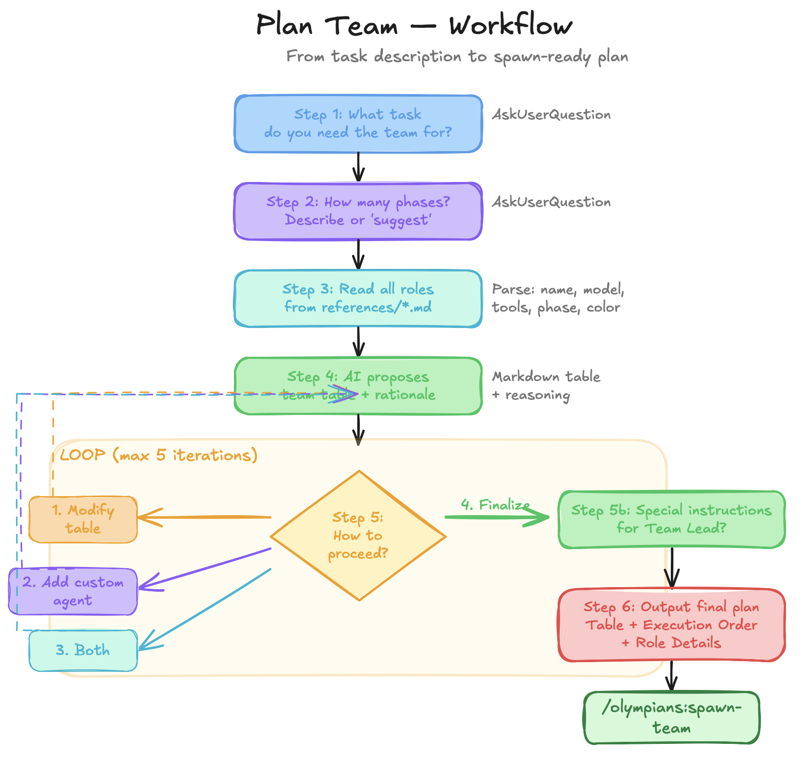

# Olympians



> We used to write scripts and save code snippets. Today we write prompts and save agent roles. The craft has changed — the mindset hasn't. Build your toolkit, share what works, iterate on what doesn't.

A Claude Code plugin for **planning, creating, and spawning [Agent Teams](https://code.claude.com/docs/en/agent-teams)**.

---

## What is Olympians?

Three skills:

- **`/olympians:spawn-team`** — Spawn a team right now. Give it roles + task, it handles the rest.
- **`/olympians:plan-team`** — Plan a complex team with phases, roles, and order. Calls spawn-team when done.
- **`/olympians:create-olympian`** — Create your own custom role from a template.

**8 generic roles** included (architect, backend-developer, frontend-developer, qa-reviewer, db-specialist, researcher, devops, test-writer). Work with any stack.

**8 example roles** in `examples/` — my personal roles for E2E testing, Stripe payments, chaos testing, multi-model research. Use them as inspiration to build your own.

---

## Prerequisites

- **Claude Code** v1.0+ with Agent Teams support
- **tmux** (optional) — for split-pane visual monitoring of all teammates simultaneously
- Example roles may require additional tools (Stripe CLI, agent-browser, Docker) — see each role's `Requires` field

---

## Installation

```bash
# Local
claude --plugin-dir ./olympians

# Marketplace
/plugin marketplace add MarioNitzke/olympians
/plugin install olympians
```

Enable Agent Teams in `~/.claude.json` (global) or `.claude/settings.json` (project):
```json
{ "env": { "CLAUDE_CODE_EXPERIMENTAL_AGENT_TEAMS": "1" } }
```

Example roles are opt-in — they must be copied into the active references directory before spawn-team can use them:
```bash
cp examples/*.md skills/spawn-team/references/
```

### Recommended: Install tmux for split-pane mode

With tmux, each teammate gets its own terminal pane — you can see all agents working simultaneously. Without it, teammates run hidden and you navigate with `Shift+Down`.

```bash
# macOS
brew install tmux

# Then set in ~/.claude.json:
{ "teammateMode": "tmux" }
```

Also works with iTerm2 (`it2` CLI + Python API enabled).

---

## When to Use What

### Spawn Team — quick, mid-work

You're working and need help now:

```bash
/olympians:spawn-team review auth changes with qa-reviewer
/olympians:spawn-team build payment feature with backend-developer and frontend-developer
/olympians:spawn-team investigate booking bug with researcher and backend-developer
```

It reads role references, infers phases, applies best practices, shows preview, launches. See [spawn-team workflow diagram](docs/spawn-team-workflow.png).

### Plan Team — structured, complex tasks



You're tackling a big problem and want to plan properly:

```
/olympians:plan-team
```

Wizard: task → phases → AI proposes team table → you modify → Team Lead instructions → **auto-calls spawn-team**.

### Create Olympian — build your own roles

```
/olympians:create-olympian
```

Shows examples for inspiration, reads your project structure, then walks you through: name → tools → model → system prompt → saved. See [create-olympian workflow diagram](docs/create-olympian-workflow.png).

---

## Generic Roles (active)

| Role | Model | Tools | Isolation |
|------|-------|-------|-----------|
| **architect** | opus | all | none |
| **backend-developer** | opus | all | worktree |
| **frontend-developer** | sonnet | all | worktree |
| **qa-reviewer** | sonnet | read-only | none |
| **db-specialist** | opus | all | worktree |
| **researcher** | sonnet | read-only | none |
| **devops** | sonnet | all | worktree |
| **test-writer** | sonnet | all | worktree |

---

## Example Roles (in `examples/`, opt-in)

These are MY roles — they show what custom roles look like. Copy what fits, modify it, or build your own.

| Role | What it does |
|------|-------------|
| **admin-tester** | E2E tests admin panel via agent-browser |
| **customer-tester** | E2E tests customer flows (logged-in or anonymous) |
| **api-tester** | Tests REST API with curl, monitors logs + DB |
| **email-tester** | Tests outgoing emails via GreenMail/Docker |
| **stripe-tester** | Tests payments via Stripe CLI |
| **angry-customer** | Chaos tester — breaks the app, consults Gemini + Codex |
| **plan-agent** | Autonomous planner — God's Plan without questions |
| **ultra-researcher** | Multi-model research across Claude + Gemini + Codex + Reddit |

### Example: How ultra-researcher works

```
/olympians:spawn-team research SignalR vs WebSockets with ultra-researcher
```

The ultra-researcher launches 4 parallel research streams:

1. **Claude** — WebSearch + WebFetch for articles and docs
2. **Reddit** — mcp__reddit__search_reddit for real user experiences
3. **Gemini** — `Skill("gemini:rescue")` for Gemini's perspective
4. **Codex** — `Skill("codex:rescue")` for Codex's perspective

Then synthesizes: consensus (all agree) → majority (3/4) → disagreements → unique findings → Reddit reality check. Output is a structured report with confidence levels and citations.

---

## Build Your Own Roles

The generic roles are a starting point. **Custom roles tailored to YOUR project are what make agent teams powerful.**

```
/olympians:create-olympian
```

Or copy an example and modify it:

```bash
cp examples/stripe-tester.md skills/spawn-team/references/my-tester.md
```

Every role is a markdown file with: name, tools, model, isolation, system prompt, spawn example. See any file in `references/` or `examples/` for the format.

---

## Best Practices

Spawn-team enforces best practices from official Claude Code docs, community research (Reddit, YouTube), and production experience. Full guide in [`best-practices.md`](skills/spawn-team/references/best-practices.md). Key points:

- **Contract-first** — foundation agents define schemas before implementation starts
- **File ownership** — no two agents on the same file
- **Delegate mode** (`Shift+Tab`) — lead coordinates, doesn't code
- **3-5 teammates**, 5-6 tasks each
- **Read-only reviewers** — can't break code
- **Competing hypotheses** — for debugging, spawn agents with different theories
- **Cross-model validation** — different models for builder vs reviewer

---

## Contributing

**Share your custom roles!** Submit a PR to `examples/`. We're building a community library of proven agent roles.

1. Create your role → 2. Test it → 3. PR to `examples/`

See [CONTRIBUTING.md](CONTRIBUTING.md) for guidelines and role file format.

---

## License

MIT
